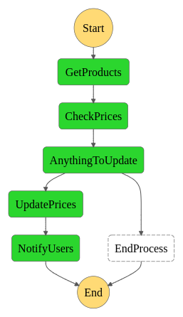
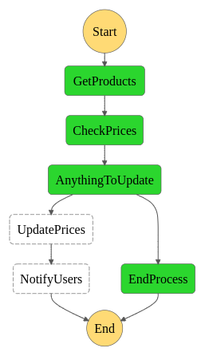

# Dealhawk Price Watcher

This service checks product prices daily, updates them to DB & notifies user via email.

## Architecture
This service is built using AWS Step Functions. Service contains 5 individual Lambda functions that Step Machine executes. Here is the visual workflows of the step functions. 

 

## Example
This is how the email looks like

